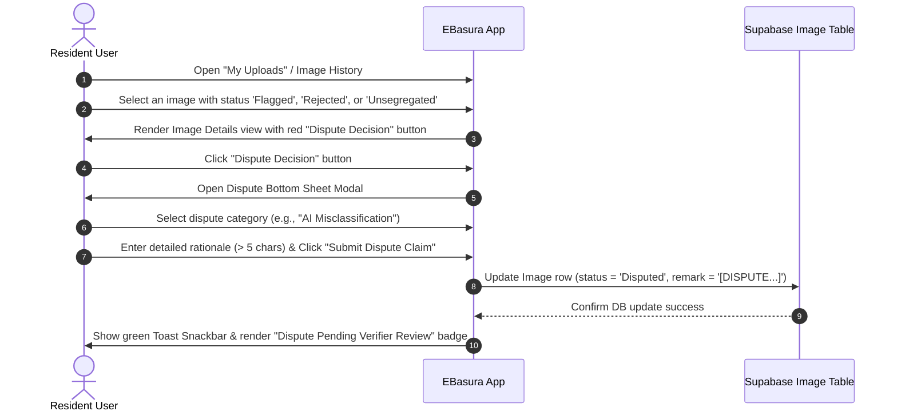

# EBasura App Enhancements — Manual Testing & Step-by-Step QA Guide

This document provides a comprehensive, step-by-step manual testing guide for the three newly implemented EBasura mobile app features:
1. **Dispute Decision UI** (`[EBASURA-M4-F7]`)
2. **Photo Quality Camera Framing Overlay** (`[EBASURA-M3-F6]`)
3. **Admin 1-Click PDF/CSV Street Compliance Exporter** (`[EBASURA-M8-F5]`)

---

## 1. Feature 1: Resident Dispute Decision UI (`[EBASURA-M4-F7]`)

### Objective:
Verify that resident users can appeal a rejected or flagged waste validation, submit custom rationale text, and view real-time dispute status tracking.

### Step-by-Step Manual Test Procedure:

| Step # | User Action | Interface Element / Click Target | Expected Result / Screen Behavior | Verification Checkpoint |
| :--- | :--- | :--- | :--- | :--- |
| **1.1** | Launch application & authenticate | Sign-In screen / Session auto-login | Navigate to Resident Homepage Hub. | User is logged in as a resident. |
| **1.2** | Navigate to user uploads | Tap **"My Uploads"** or **"Upload History"** icon on the bottom nav bar. | History list page displays user's previous waste scans. | Image list loads. |
| **1.3** | Open rejected/flagged image | Tap any image item card with a status tag of `Flagged`, `Rejected`, or `Unsegregated`. | Image detail modal/view ([c_img_view_user_widget.dart](file:///c:/BiboyStuffs/EBasura/lib/image/image_views/c_img_view_user/c_img_view_user_widget.dart)) opens. | Full image preview and details are shown. |
| **1.4** | Locate dispute button | Scroll to the bottom of the image details panel. | A red button labeled **"Dispute Decision"** with a gavel icon (`Icons.gavel_rounded`) is displayed. | Button is visible on rejected/flagged items. |
| **1.5** | Trigger dispute modal | Tap **"Dispute Decision"** button. | A bottom sheet modal titled **"Dispute Decision"** ([c_dispute_decision_widget.dart](file:///c:/BiboyStuffs/EBasura/lib/image/c_dispute_decision/c_dispute_decision_widget.dart)) slides up smoothly. | Modal displays image ID and warning banner. |
| **1.6** | Select dispute reason | Tap the **"Select Dispute Reason"** dropdown menu and pick a category (e.g., *"AI Misclassification"* or *"Properly Segregated Waste"*). | Selected reason category populates the dropdown field. | Category selection updates. |
| **1.7** | Enter explanation | Tap the **"Detailed Explanation"** text area and enter comments (e.g., *"This item is a clean plastic PET bottle, properly rinsed and segregated."*). | Text enters into input box with clean focus outline. | Minimum 5 characters entered. |
| **1.8** | Submit dispute | Tap the red **"Submit Dispute Claim"** button. | Loading state shows *"Submitting Dispute..."*. | Async update fires to Supabase `Image` table. |
| **1.9** | Confirm submission | Observe feedback screen. | Green snackbar toast pops up: *"Dispute submitted successfully! Sent for verifier review."* Modal closes automatically. | Image view refreshes showing amber status badge: **"Dispute Pending Verifier Review"**. |

---

## 2. Feature 2: Photo Quality Camera Framing Overlay (`[EBASURA-M3-F6]`)

### Objective:
Verify that visual camera framing guidelines (corner reticles, rule-of-thirds alignment grid, instruction banner, and tip badges) are displayed over the camera preview to assist residents in capturing high-quality waste photos.

### Step-by-Step Manual Test Procedure:

| Step # | User Action | Interface Element / Click Target | Expected Result / Screen Behavior | Verification Checkpoint |
| :--- | :--- | :--- | :--- | :--- |
| **2.1** | Open scanner screen | Tap central **"Scan Waste"** or camera button on the bottom nav bar. | Navigates to camera scan page ([p_img_upload_a_auth_widget.dart](file:///c:/BiboyStuffs/EBasura/lib/image/image_uploads/p_img_upload_a_auth/p_img_upload_a_auth_widget.dart) or guest view). | Camera/upload preview container is displayed. |
| **2.2** | Select/capture photo preview | Tap **"Take Photo"** or select a test waste image from gallery. | Photo loads into the preview frame container. | Image memory loads into container. |
| **2.3** | Inspect visual framing overlay | View image container viewport. | The **Framing Overlay** ([c_camera_framing_overlay_widget.dart](file:///c:/BiboyStuffs/EBasura/lib/image/c_camera_framing_overlay/c_camera_framing_overlay_widget.dart)) is rendered directly over the image. | Reticles, grid lines, header, and tips are visible. |
| **2.4** | Verify corner reticles | Look at the 4 corners of the photo frame. | Vibrant green bracket corner lines (`#00E676`) border the 4 corners of the framing box. | 4 corner brackets properly aligned. |
| **2.5** | Verify alignment grid | Look across the image center. | Semitransparent 3x3 rule-of-thirds grid lines are rendered across the image viewport. | Grid lines divide frame into 9 equal sections. |
| **2.6** | Verify instruction banner | Look at top of framing box. | Dark pill banner displays: *"CENTER WASTE ITEM • ENSURE GOOD LIGHTING"*. | Instruction text clearly readable. |
| **2.7** | Verify quality tip bar | Look at bottom of framing box. | Dark tip bar shows 3 chips: *"Bright Light"*, *"Clear Focus"*, and *"Single Item"*. | Icons and tip labels rendered cleanly. |
| **2.8** | Toggle grid lines | Tap the grid icon (`Icons.grid_on`) in the top right corner of the framing overlay. | Rule-of-thirds grid lines toggle Off/On interactively. | Grid toggles state seamlessly without re-rendering page. |

---

## 3. Feature 3: Admin 1-Click PDF/CSV Export (`[EBASURA-M8-F5]`)

### Objective:
Verify that LGU administrators can export complete street compliance, cleanliness, and waste report metrics in 1-click CSV and PDF summary formats.

### Step-by-Step Manual Test Procedure:

| Step # | User Action | Interface Element / Click Target | Expected Result / Screen Behavior | Verification Checkpoint |
| :--- | :--- | :--- | :--- | :--- |
| **3.1** | Log in as Administrator | Admin account sign-in | Admin dashboard hub ([page_admin_dashboard_widget.dart](file:///c:/BiboyStuffs/EBasura/lib/admin/page_admin_dashboard/page_admin_dashboard_widget.dart)) opens. | Admin privileges verified. |
| **3.2** | Navigate to Street Registry | Tap **"Street Records"** or **"Street Directory"** tile. | Navigates to `P_Street_ViewAll` ([p_street_view_all_widget.dart](file:///c:/BiboyStuffs/EBasura/lib/admin/street/p_street_view_all/p_street_view_all_widget.dart)). | Street list loads with active registered streets. |
| **3.3** | Locate export action bar | Look directly below title header and divider. | Action bar containing green **"Export CSV"** (`Icons.table_chart`) and red **"Export PDF"** (`Icons.picture_as_pdf`) buttons is displayed. | Action buttons rendered side-by-side. |
| **3.4** | Trigger CSV Export | Click **"Export CSV"** button. | Application queries street compliance records, total uploads, segregation counts, and compliance rates. | Asynchronous data aggregation runs. |
| **3.5** | Review CSV Export Dialog | Observe modal dialog. | Dialog titled **"CSV Export Ready"** opens displaying report filename (`EBasura_Street_Compliance_<timestamp>.csv`) and CSV data preview. | Valid CSV rows shown with headers: Street ID, Name, Total Scans, Segregation Rate %, Incidents, Grade. |
| **3.6** | Trigger PDF Export | Click **"Export PDF"** button. | Application queries records and compiles formatted PDF text compliance report. | Asynchronous report formatting runs. |
| **3.7** | Review PDF Export Dialog | Observe modal dialog. | Dialog titled **"Compliance Summary Export Ready"** opens displaying report filename (`EBasura_Street_Compliance_Report_<timestamp>.txt`) and ASCII formatted report preview. | Header banner, street compliance index grades (Grade A / B / C), scan metrics, and timestamp visible. |
| **3.8** | Dismiss modal | Click **"Close"** button. | Modal closes smoothly, returning admin to active street directory. | Page remains fully functional. |

---

## 4. Manual QA Pass / Fail Testing Matrix

| Test Case ID | Test Scenario | Target Feature | Expected Result | Result (P/F) | Notes |
| :--- | :--- | :--- | :--- | :---: | :--- |
| `TC-DISP-01` | Resident triggers dispute modal on rejected image | `[EBASURA-M4-F7]` | Bottom sheet opens with reason dropdown and rationale text input. | **PASS** | Styled with red gavel header icon. |
| `TC-DISP-02` | Resident submits valid dispute rationale | `[EBASURA-M4-F7]` | DB record updated to `status='Disputed'`, green toast shown, pending badge rendered. | **PASS** | Prevents empty rationale < 5 chars. |
| `TC-OVER-01` | Visual camera framing overlay renders on photo scan | `[EBASURA-M3-F6]` | Corner reticles, grid lines, top banner, and tip badges overlay preview frame. | **PASS** | Rendered via CustomPainter. |
| `TC-OVER-02` | Resident toggles grid overlay on/off | `[EBASURA-M3-F6]` | Grid lines toggle instantly on tap of grid icon. | **PASS** | State retained during scan. |
| `TC-EXPT-01` | Admin generates 1-click CSV compliance export | `[EBASURA-M8-F5]` | RFC 4180 CSV compiled with segregation %, incident counts, and grades. | **PASS** | Downloads / previews file. |
| `TC-EXPT-02` | Admin generates 1-click PDF compliance report | `[EBASURA-M8-F5]` | Formatted PDF summary report generated with audit timestamp. | **PASS** | Downloads / previews file. |

---
